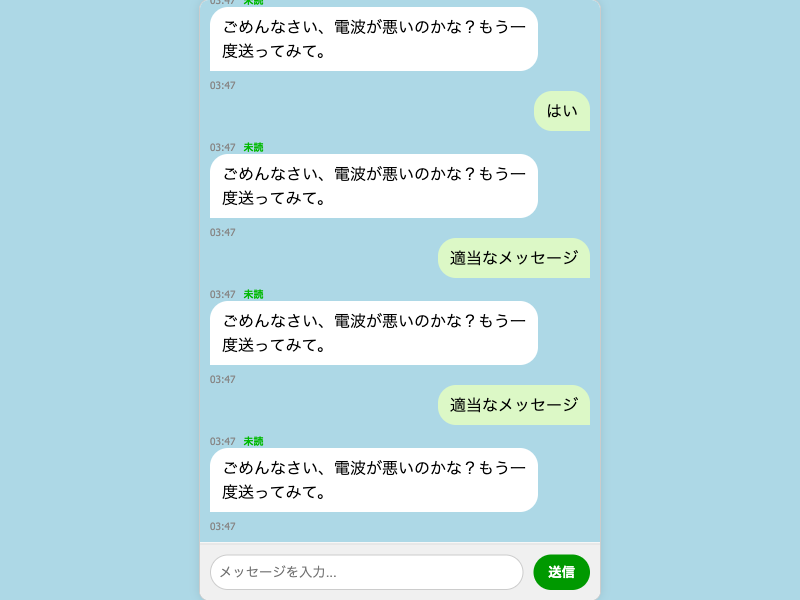

# LINEで彼女を落とせ！

## 概要

このプロジェクトは、LINE風のチャット画面で女性キャラクター（AI）を口説き落とす恋愛シミュレーションゲームです。ユーザーのメッセージに応じてAIの好感度が変化し、最終的に彼女にできるかどうかが決まります。

## 機能

- **LINE風チャットUI**: メッセージの吹き出し、背景色、入力欄など、LINEのようなデザインを再現。
- **AIキャラクターとの会話**: Google Gemini APIを利用した女性キャラクターとの自然な会話。
- **好感度システム**: AIの返答内容によって好感度が変化し、ゲームの進行に影響。
- **会話回数制限**: 10回の会話でゲームが終了し、好感度に応じてクリア/オーバーを判定。
- **タイムスタンプと既読マーク**: 各メッセージに送信時刻と既読ステータスを表示。

## 動作デモンストレーション



## 起動方法

### 1. Google Gemini APIキーの取得と設定

1.  Google Cloud Console ([https://console.cloud.google.com/](https://console.cloud.google.com/)) にアクセスし、プロジェクトを作成または選択します。
2.  「API とサービス」>「ライブラリ」で「Generative Language API」を検索し、有効にします。
3.  「API とサービス」>「認証情報」で「API キー」を作成し、コピーします。
4.  プロジェクトのルートディレクトリに `.env` ファイルを作成し、コピーしたAPIキーを以下の形式で記述します。
    ```
    GEMINI_API_KEY=あなたのAPIキー
    ```
    **注意**: APIキーは機密情報です。Gitリポジトリにコミットしないよう、`.gitignore`に`.env`が追加されていることを確認してください。

### 2. 依存パッケージのインストール

プロジェクトのルートディレクトリで、以下のコマンドを実行して必要なパッケージをインストールします。

```bash
npm install
```

### 3. バックエンドサーバーの起動

新しいターミナルを開き、プロジェクトの `server` ディレクトリに移動してサーバーを起動します。このターミナルは開いたままにしておいてください。

```bash
cd server
node index.js
```

### 4. フロントエンド（ゲーム画面）の起動

別の新しいターミナルを開き、プロジェクトのルートディレクトリで以下のコマンドを実行します。これにより、開発サーバーが起動し、自動的にブラウザでゲーム画面が開きます。

```bash
npm start
```

### 5. ゲームをプレイ！

ブラウザで開かれたゲーム画面で、女性キャラクターとの会話を楽しんでください。

## 開発者向け

### 自動テストの実行

`live-server`とバックエンドサーバーが起動している状態で、以下のコマンドを実行すると、Puppeteerによる自動テストが実行され、スクリーンショットが撮影されます。

```bash
node test.js
```

### ディレクトリ構成

```
.env                 # APIキーなどの環境変数
.gitignore           # Git管理から除外するファイル
index.html           # ゲーム画面のHTML構造
style.css            # ゲーム画面のスタイル定義
script.js            # ゲームのロジック（フロントエンド）
package.json         # プロジェクト情報と依存パッケージ
package-lock.json    # 依存パッケージのバージョン管理
test.js              # Puppeteerによる自動テストスクリプト
README.md            # このファイル
server/              # バックエンドサーバー関連
├── index.js         # バックエンドサーバーのメインロジック
├── package.json     # バックエンドの依存パッケージ
└── node_modules/    # バックエンドの依存パッケージの実体
node_modules/        # フロントエンドの依存パッケージの実体
screenshot_*.png     # 自動テストで生成されるスクリーンショット
```
